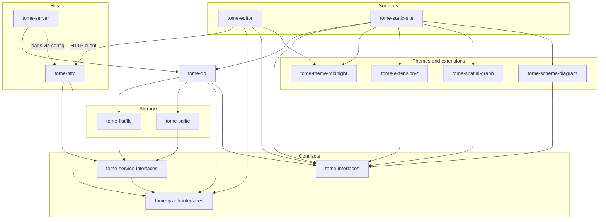

# Tome

Tome is tooling for design graphs that live in git. Your corpus stays as ordinary files—the source of truth—while a local SQLite cache keeps exploration and edits fast. The same graph powers a web editor, a config-driven API host, and static site export, without baking any one domain into the packages.

## Highlights

- **Git-tracked corpus** — nodes and relationships under `content/`; SQLite is a rebuildable query cache, not the canonical store ([`docs/features/tome-db.md`](docs/features/tome-db.md))
- **Web editor** — browse and edit the graph as pages, tables, and related views ([`docs/features/tome-editor.md`](docs/features/tome-editor.md))
- **Config-driven host** — wire store, cache, and HTTP services from project config ([`docs/features/tome-server.md`](docs/features/tome-server.md))
- **Static site export** — publish the corpus to portable HTML ([`docs/features/static-website.md`](docs/features/static-website.md))
- **Extensions** — load page blocks and other components from project config at runtime ([`docs/features/extensions.md`](docs/features/extensions.md))
- **Domain stays in the project** — workspace model, associations, and schemas live under `content/model/`, not in Tome package source

## Packages

| Package | Role |
| ------- | ---- |
| `packages/tome-db/` | Property graph storage, content sync, schema loaders |
| `packages/tome-graph-interfaces/` | Domain DTOs + `TomeGraphServices` |
| `packages/tome-service-interfaces/` | `TomeServiceModule` contracts |
| `packages/tome-http/` | HTTP service module + client SDK |
| `packages/tome-server/` | Config-driven host (wires db + services) |
| `packages/tome-editor/` | Vite/React markdown editor (client only) |
| `packages/tome-static-site/` | Astro static site generator |

See [`packages/README.md`](./packages/README.md) for the full package list.



## Development

When modifying Tome, this repo is typically opened via **silentorb-workbench**, which bind-mounts `tome` and a domain repo (e.g. marloth-story) and runs the editor in a Compose `tome` service built from [`docker/Dockerfile.dev`](./docker/Dockerfile.dev).

Standalone (with `TOME_CONTENT_PATH` set):

```bash
bun install --frozen-lockfile
bun run editor:dev
```

**Containers:** [`docs/features/container.md`](./docs/features/container.md) — `docker/Dockerfile.dev` (workbench), `docker/Dockerfile.release` (offline GHCR image). Local release build: `bash docker/build-release.sh`.

See [`AGENTS.md`](./AGENTS.md) and [`docs/features/`](./docs/features/) for feature specs.
