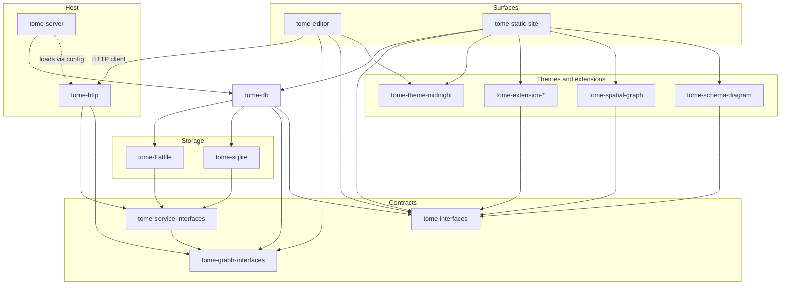

# Tome

Domain-agnostic tooling for git-tracked design graphs: SQLite query cache (`tome-db`), config-driven server host (`tome-server` + `tome-http`), web editor (`tome-editor`), and static site export (`tome-static-site`).

## Packages

| Package | Role |
| ------- | ---- |
| `packages/tome-db/` | Property graph storage, content sync, schema loaders |
| `packages/tome-graph-interfaces/` | Domain DTOs + `TomeGraphServices` |
| `packages/tome-service-interfaces/` | `TomeServiceModule` contracts |
| `packages/tome-http/` | HTTP service module + client SDK |
| `packages/tome-server/` | Config-driven host (wires db + services) |
| `packages/tome-editor/` | Vite/React markdown editor (client only) |
| `packages/tome-static-site/` | Astro static site generator |

See [`packages/README.md`](./packages/README.md) for the full package list.



## Development

This repo is typically opened via **silentorb-workbench**, which bind-mounts `tome` and a domain repo (e.g. marloth-story) and runs the editor in a Compose `tome` service with `TOME_CONTENT_PATH` pointing at the domain `content/` directory.

Standalone (with `TOME_CONTENT_PATH` set):

```bash
bun install --frozen-lockfile
bun run editor:dev
```

See [`AGENTS.md`](./AGENTS.md) and [`docs/features/`](./docs/features/) for feature specs.
