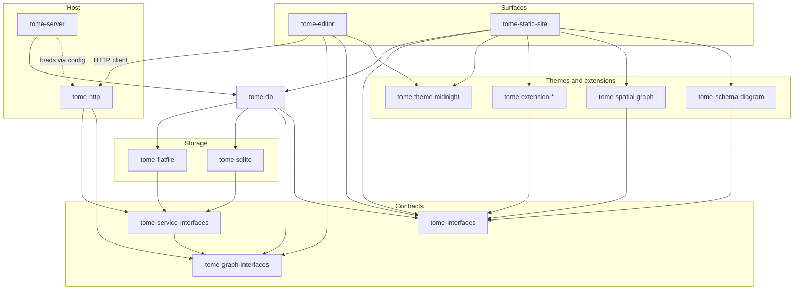

# Tome

Tome is a graph-based corpus application.

Tome is written in TypeScript and largely consists of a Bun server and a React web editor.

## Ontology

Each Tome document is a node.

Nodes can be connected to other nodes using bidirectional, semantic relationships.

A corpus is a single container consisting of a set of nodes and a set of relationships.

A site is a higher level grouping of one or more corpora.  (Eventually Tome may unify sites and corpora into some form of nested corpora.)

## Problems and solutions

Tome solves the following problems.

### Organic organization

#### Problem

Document/data solutions often create a tension between structured and non-structured data.

Either the data is unstructured, or the data must be created within an existing structure.

In the latter case, each data record has a single type, and changing the type often requires creating a new record.

#### Solution

Tome schemas are purely relational.

By default, Tome nodes have no schema beyond their ID, title, content, and relationships.

A Tome node can inherit additional semantic properties based on its relationships.

For example, Tome relationships can be used as a type system, where certain nodes represent types, and other nodes can be members of those type nodes.  The type nodes can specify qualities about their members.

A node can have multiple types, in the same way that a man can be both a husband and a father.

Type relationships can be added and removed, allowing a node to be drafted with no type, then associated with a type, then later deassociated with that type, allowing the node to adapt as circumstances change.

### Decentralized storage

#### Problem

Similar document/data solutions usually only support one of two data stores: Centralized database or flat file.

Centralized databases scale fairly well, both in terms of data volume and number of users.

However, they are centralized, do not naturally support history, and are heavier to setup and maintain.

Meanwhile, a flat file database can be Git tracked and is easy for a single user to create and manage.

However a flat file database is inefficient to query and write to at large volumes, and is not practical for multiple users.

#### Solution

Instead of one or the other, why not have both?

Tome supports both flat file and SQL databases, and can automatically sync between the two.

It's default workflow is for source-of-truth data to be stored in a flat-file Git repository, which is dynamically synced to a SQL database which the web app uses as a full cache.

Note: Tome does not yet support a fully independent SQL database, but that is planned in the future and will be trivial to implement.

### Multiple data stores

#### Problem

Similar document/data solutions usually only support a single database of records.

If users want to access data across two different instances, they either need to separate logins or the data needs to consolidated by migrating data from one instance to the other.

#### Solution

A single Tome app can serve multiple corpora (data sources) at once.

Tome uses ULIDs as a universal Node ID mechanism, allowing seamless cross-referencing between corpora.

It is trivial to add and remove corpora to a Tome server.

### Extensibility

#### Problem

Plugin systems promise tremendous extensibility but run into problems with integration.

When multiple plugins are modifying the same functionality, they tend to conflict.

The problem with that arrangement is there is no single integration authority.

The plugin system can provide general arbitration, but it cannot know how to arbitrate between the specialized functionality each plugin is introducing.

In practice, most major plugin systems survive through close coordination between their maintainers, where the top plugins for the platform are specifically designed to work with each other.

#### Solution

Integration between particular extensions is a specialized problem, and needs a specialized solution.

Extensibility is cleaner when extensions are libraries of discrete building blocks which the user integrates.

For Tome, extensions provide components which can be used by individual nodes.  Components can expose configuration to be either per node or per corpus.  (Eventually Tome may support component configuration at the site level, where one site can contain multiple corpora.)

If users commonly need a particular integration of particular extensions, that solution can be abstracted into an integration extension and reused across nodes and corpora.

The primary interface for Tome extensibility is [Imp](https://github.com/silentorb/imp-ts).

## Additional notable features

- Native support for both unordered and ordered relationships
- Static site generation
- Coding agent integration
- Basic reporting

## Packages

| Package | Role |
| ------- | ---- |
| `packages/tome-db/` | Property graph storage, content sync, schema loaders |
| `packages/tome-graph-interfaces/` | Domain DTOs + `TomeGraphServices` |
| `packages/tome-service-interfaces/` | `TomeServiceModule` contracts |
| `packages/tome-http/` | HTTP service module + client SDK |
| `packages/tome-server/` | Config-driven host (wires db + services) |
| `packages/tome-editor/` | Vite/React markdown editor (client only) |
| `packages/tome-static-site/` | Astro static site generator |

See [`packages/README.md`](./packages/README.md) for the full package list.



## Development

When modifying Tome, this repo is typically opened via **silentorb-workbench**, which bind-mounts `tome` and a domain repo (e.g. marloth-story) and runs the editor in a Compose `tome` service built from [`docker/Dockerfile.dev`](./docker/Dockerfile.dev).

Standalone (with `TOME_CONTENT_PATH` set):

```bash
bun install --frozen-lockfile
bun run editor:dev
```

**Containers:** [`docs/features/container.md`](./docs/features/container.md) — `docker/Dockerfile.dev` (workbench), `docker/Dockerfile.release` (offline GHCR image). Local release build: `bash docker/build-release.sh`.

See [`AGENTS.md`](./AGENTS.md) and [`docs/features/`](./docs/features/) for feature specs.
