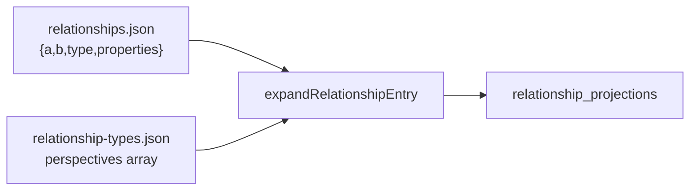

# Set membership

## Summary

Set membership is one of two **relationship families** in the Tome property graph. A membership edge links a **set node** (type table, Archive hub, future tag/scope sets) to a **member node**. Storage uses composite type `member_of` with asymmetric **perspectives**: `member_of` from the member, `members` from the set.

Peer **association** (scene↔feature, etc.) remains on the separate `includes` family — see [tome-db.md](./tome-db.md).

## When to read this

Read this doc when your task involves:

- Type-table row membership (`member_of` / `members`)
- Archive hub membership (migrated from legacy `includes`)
- Projection expansion for membership edges
- Querying members of a set or sets a node belongs to
- Distinguishing set membership from cross-entity association

For design-domain meaning of types and sets, read [`../ontology.md`](../../marloth-story/docs/ontology.md) alongside this doc.

## Requirements

### Two relationship families

| Family | Storage type | Perspectives | Examples |
| --- | --- | --- | --- |
| **Set membership** | `member_of` | `["member_of", "members"]` | Features row, Themes row, Archive member |
| **Peer association** | `includes` (+ named composites) | `["includes", "includes"]` or distinct pair | Scene↔Feature, taxonomy↔Inspiration |

### Content record shape (membership)

```json
{
  "a": "<sorted-smaller-id>",
  "b": "<sorted-smaller-id>",
  "type": "member_of",
  "properties": { "view": "All", "row_index": 3 }
}
```

- Endpoints `a` / `b` **must** be sorted lexicographically.
- **`directedFrom` must not** appear on membership records — direction is expressed by perspective at query time.
- Row scalars for type tables live on edge `properties` (keys from `table-schemas.json`).

### Projection expansion

Expansion is driven solely by `perspectives.length` in `relationship-types.json`:

| `perspectives.length` | Projections |
| --- | --- |
| ≥ 2 | Index 0: member → set with `member_of`; index 1: set → member with `members` (oriented via set node ids) |
| 1 | Single projection `a → b` with `perspectives[0]` |

The legacy `bidirectional` flag is **deprecated** — parsers may ignore it; expansion uses perspective count only.

For `member_of`: `(member)-[:member_of]->(set)` and `(set)-[:members]->(member)` from one content record.

### Set-kind interpretation

Set semantics are **orthogonal** to edge type. A set node carries interpretation via workspace config:

| Set kind | Detection | Member effect |
| --- | --- | --- |
| `type_table` | Node id key in `table-schemas.json` | Members table, Properties panel scalars, type filtering |
| `archive` | `nodeId === workspace.archiveNodeId` | Excluded from search/graph via `nodes.is_archived` |
| Future (tags, scope) | TBD (`sets.json` or node metadata) | Per-set filter rules |

### Query API

Primary helper: `listSetMembership(db, nodeId, perspective)` where `perspective` is `"member_of"` or `"members"`.

- `"member_of"`: outgoing projections from `nodeId` (member → set)
- `"members"`: outgoing projections from `nodeId` (set → member)

Higher-level helpers:

- `setMemberIds(db, setId)` — members of a set
- `memberSetIds(db, memberId)` — sets a member belongs to
- `setKindForNode(db, nodeId, contentDir)` — `"type_table" | "archive" | null`

**Cardinality** (1:N UI, schema rules) is enforced in UI and `schema.json` — not in storage or projection count. Data layer is M:N.

### Archive membership

Archive membership uses `member_of` edges to the Archive hub (same family as type tables). Archiving:

1. Marks incident relationships `archived: true` in content
2. Adds hub membership edge `(member)-[:member_of]->(archive)` (no `archived` on hub edge)
3. Recomputes `nodes.is_archived` on sync

### Link vs create row

Linking an existing node to a type table via `linkOutgoingRelationship` **must** stamp `view` and `row_index` on the membership edge (same as `createNode` with `kind: "database-row"`).

### Node page sections

| Page kind | Membership UI |
| --- | --- |
| **Set / type-table node** | Single **Members** table section (`database` or `ordered-association`) — full columns, tabs, editing via `getDatabaseViewDetail` |
| **Member instance node** | **Properties** panel only (edge scalars from `member_of`); no membership relation table section |

The simple auto-generated `members` relation section is **not** emitted — set membership listing uses the rich Members table on set pages only.

## Design rationale

**Why dual projections without `directedFrom`?** Membership is asymmetric in meaning (member belongs to set; set contains members) but symmetric in storage (sorted endpoints). Perspectives encode the asymmetry; queries use `listRelationshipsFromSource` with the appropriate perspective slug.

**Why unify archive with type tables?** Both are “node belongs to set” with different set-kind behavior. Special-casing archive as `includes` duplicated query paths and collided semantically with peer association.

## Behavior / pipeline



1. Content write: `ContentStore.upsertRelationship` writes sorted `{a,b,type:member_of,properties}` without `directedFrom`.
2. Sync: `expandRelationshipEntry` emits two projections for `member_of`.
3. Query: type tables use `listSetMembership(setId, "members")`; instance Properties use `listSetMembership(instanceId, "member_of")`.

## Inputs / outputs / artifacts

| Path | Role |
| --- | --- |
| `content/data/relationships.json` | Canonical membership records |
| `content/model/relationship-types.json` | `member_of` perspectives `["member_of", "members"]` |
| `content/model/table-schemas.json` | Type-table set detection + column defs |
| `content/model/views.json` | `sections.members` tab config for Members table |
| `content/model/workspace.json` | `archiveNodeId` for archive set detection |
| `packages/tome-db/src/set-membership.ts` | Unified membership query API |
| `packages/tome-db/src/content/relationship-sync-expand.ts` | Perspective-based expansion |

## Migration

Scripts (marloth-story):

1. `scripts/migrate-membership-projections.ts` — strip `directedFrom`, archive `includes`→membership, backfill row metadata (historical; may reference legacy `is_a` slug)
2. `scripts/migrate-is-a-to-member-of.ts` — rename storage `is_a`→`member_of`, `views.json` `sections.items`→`sections.members`

**Invariants after full migration:**

- Every `member_of` record → exactly 2 projections (`member_of`, `members`)
- No archive-hub `includes` edges remain
- Type-table pages show one Members table (not Items + duplicate relation section)

## Non-goals (future)

- **Multi-hop path semantics** — interpreting edge meaning from neighborhood paths (e.g. Types meta-set)
- Renaming storage type `member_of` → neutral slug like `membership`
- API-level schema enforcement of allowed edges

## Implementation pointers

| Module | Responsibility |
| --- | --- |
| `set-membership.ts` | `listSetMembership`, `setKindForNode`, member/set id helpers |
| `relationship-sync-expand.ts` | Perspective-count expansion |
| `database-view.ts` | Members table rows via `members` perspective |
| `node-page-sections.ts` | Members table on set pages; Properties on instances |
| `archive-status.ts` | Archive via membership to hub |
| `node-lifecycle.ts` | Archive/unarchive writes membership edges |
| `relationship-link-mutations.ts` | Row metadata on link-existing |

## See also

- [tome-db.md](./tome-db.md) — property graph storage and sync
- [table-schemas.md](./table-schemas.md) — type-table columns
- [views.md](./views.md) — Members section tabs
- [schema.md](./schema.md) — relationship rules (peer association)
- [`../ontology.md`](../../marloth-story/docs/ontology.md) — design domain model
