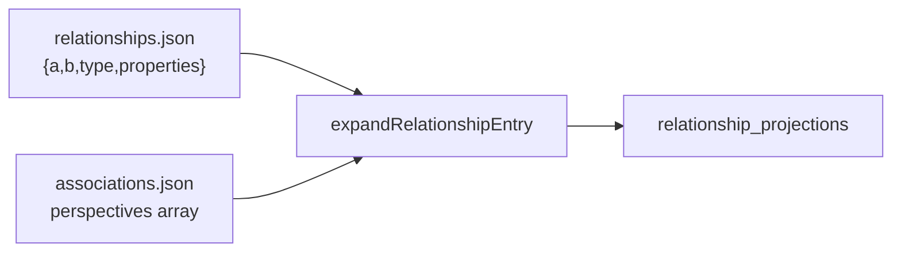

# Set membership

## Summary

Set membership is one of two **relationship families** in the Tome property graph. A membership edge links a **set node** (type table, Archive hub, future tag/scope sets) to a **member node**. Storage uses composite types with asymmetric **perspectives**:

| Composite | Perspectives | Traits | Use |
| --- | --- | --- | --- |
| `member_of` | `members` / `member_of` | `set` | Plain type tables, Archive |
| `ordered_member_of` | `ordered_members` / `ordered_member_of` | `set`, `ordered` | Scenes, Parts, Products (sequence on `order`) |

Which composite a type table uses is declared per set in `table-schemas.json` as `membershipComposite` (default `member_of`).

Peer **association** (scene↔feature, etc.) remains on the separate `includes` family — see [tome-db.md](./tome-db.md).

## When to read this

Read this doc when your task involves:

- Type-table row membership (`member_of` / `members`)
- Archive hub membership (migrated from legacy `includes`)
- Projection expansion for membership edges
- Querying members of a set or sets a node belongs to
- Distinguishing set membership from cross-entity association

For design-domain meaning of types and sets, read [`../ontology.md`](../../marloth-story/docs/ontology.md) alongside this doc.

## Requirements

### Two relationship families

| Family | Storage type | Perspectives | Examples |
| --- | --- | --- | --- |
| **Plain set membership** | `member_of` | `["members", "member_of"]` | Features, Themes, Archive |
| **Ordered set membership** | `ordered_member_of` | `["ordered_members", "ordered_member_of"]` | Scenes, Parts, Products rows |
| **Peer association** | `includes` (+ named composites) | `["includes", "includes"]` or distinct pair | Scene↔Feature, taxonomy↔Inspiration |

### Content record shape (membership)

```json
{
  "a": "<set-id>",
  "b": "<member-id>",
  "type": "member_of",
  "properties": { "priority": "High" }
}
```

Ordered sets use `type: "ordered_member_of"` with an `order` property (default sequence key from the `ordered` trait).

- Endpoints `a` / `b` are an **ordered tuple**: the **parent (set)** is at index 0 (`a`), the **child (member)** at index 1 (`b`). This matches the type's `perspectives` pair (`perspectives[0]` = parent/set position, `perspectives[1]` = child/member position). There is **no lexicographic sorting**.
- Registry entries carry `traits` as an **array interpreted as a set** — e.g. `["set"]` or `["set", "ordered"]`. Configured traits use `{ "key": "ordered", "property": "rank" }`; when `property` is omitted, `order` is the default sequence key.
- **No `directedFrom` field exists** — direction is derived from tuple position + the type's perspectives, not a stored flag.
- Row scalars for type tables live on edge `properties` (keys from `table-schemas.json`). Legacy `row_index` is not written or displayed.

### Projection expansion

Every relationship type in `associations.json` defines a `perspectives` **tuple of exactly two** slugs, so expansion always emits two projections:

| Endpoint | Projection |
| --- | --- |
| Index 0 | node at `a` → node at `b` with `perspectives[0]` (`members`) — oriented purely by tuple position |
| Index 1 | node at `b` → node at `a` with `perspectives[1]` (`member_of`) |

There is **no `bidirectional` field** — the parser rejects any type that does not define exactly two perspectives, so a non-bidirectional type cannot exist. (An unregistered storage type falls back to a single defensive projection during sync, but registered types are always a pair.)

For `member_of`: `(member)-[:member_of]->(set)` and `(set)-[:members]->(member)` from one content record.

### Set-kind interpretation

Set semantics are **orthogonal** to edge type. A set node carries interpretation via workspace config:

| Set kind | Detection | Member effect |
| --- | --- | --- |
| `type_table` | Node id key in `table-schemas.json` | Members table, Properties panel scalars, type filtering |
| `archive` | `nodeId === workspace.archiveNodeId` | Excluded from search/graph via `nodes.is_archived` |
| Future (tags, scope) | TBD (`sets.json` or node metadata) | Per-set filter rules |

### Query API

Primary helper: `listSetMembership(db, nodeId, perspective)` where `perspective` is `"member_of"` or `"members"`.

- `"member_of"`: outgoing projections from `nodeId` (member → set)
- `"members"`: outgoing projections from `nodeId` (set → member)

Higher-level helpers:

- `setMemberIds(db, setId)` — members of a set
- `memberSetIds(db, memberId)` — sets a member belongs to
- `setKindForNode(db, nodeId, contentDir)` — `"type_table" | "archive" | null`

**Cardinality** (1:N UI, schema rules) is enforced in UI and `schema.json` — not in storage or projection count. Data layer is M:N.

### Archive membership

Archive membership uses `member_of` edges to the Archive hub (same family as type tables). Archiving:

1. Marks incident relationships `archived: true` in content
2. Adds hub membership edge `(archive)-[:members]->(member)` stored as `{ a: archive, b: member, type: member_of }` (no `archived` on hub edge)
3. Recomputes `nodes.is_archived` on sync

### Link vs create row

Linking or creating a type-table row **must** use the set's configured membership composite (`member_of` or `ordered_member_of`). Plain tables get no placement metadata. Ordered tables auto-stamp `order` when missing (`ordered-relationships.ts`).

### Node page sections

| Page kind | Membership UI |
| --- | --- |
| **Set / type-table node** | Single **Members** or **Ordered members** table section (`database` or `ordered-collection`) — full columns, tabs, editing via `getDatabaseViewDetail` |
| **Member instance node** | **Properties** panel in metadata (edge scalars from membership) **and** one **Membership** relation section below the markdown body |

The auto-generated inverse **`members`** relation section is **not** emitted on set pages — membership listing there uses the rich Members table only. The Membership section header does **not** link to a single parent set (rows link to each parent).

## Design rationale

**Why dual projections without `directedFrom`?** Membership is asymmetric in meaning (member belongs to set; set contains members) and that asymmetry is encoded by the **ordered tuple** `(member, set)` plus the type's ordered perspectives — not by a stored direction flag. Expansion binds `perspectives[0]` to index 0 and `perspectives[1]` to index 1; queries use `listRelationshipsFromSource` with the appropriate perspective slug.

**Why unify archive with type tables?** Both are “node belongs to set” with different set-kind behavior. Special-casing archive as `includes` duplicated query paths and collided semantically with peer association.

## Behavior / pipeline


```mermaid
flowchart LR
  JSON["relationships.json\n{a,b,type,properties}"]
  REG["associations.json\nperspectives array"]
  EXP["expandRelationshipEntry"]
  PROJ["relationship_projections"]

  JSON --> EXP
  REG --> EXP
  EXP --> PROJ
```

1. Content write: `ContentStore.upsertRelationship` writes the ordered tuple `{ a: set, b: member, type: member_of, properties }` (parent at index 0, child at index 1).
2. Sync: `expandRelationshipEntry` emits two projections for `member_of`.
3. Query: type tables use `listSetMembership(setId, "members")`; instance Properties use `listSetMembership(instanceId, "member_of")`.

## Inputs / outputs / artifacts

| Path | Role |
| --- | --- |
| `content/data/relationships.json` | Canonical membership records |
| `content/model/associations.json` | `member_of` / `ordered_member_of` perspectives, traits array, optional `perspectiveLabels` |
| `content/model/table-schemas.json` | Type-table set detection, optional `membershipComposite`, column defs |
| `content/model/views.json` | `sections.members` tab config for Members table |
| `content/model/workspace.json` | `archiveNodeId` for archive set detection |
| `packages/tome-db/src/set-membership.ts` | Unified membership query API |
| `packages/tome-flatfile/src/association-traits.ts` | Set trait helpers (`parentNodeId`, `childNodeId`, `resolveSetTraitComposite`) |
| `packages/tome-db/src/content/relationship-sync-expand.ts` | Perspective-based expansion |

## Migration

Scripts (marloth-story):

1. `scripts/migrate-membership-projections.ts` — strip `directedFrom`, archive `includes`→membership, backfill row metadata (historical; may reference legacy `is_a` slug)
2. `scripts/migrate-is-a-to-member-of.ts` — rename storage `is_a`→`member_of`, `views.json` `sections.items`→`sections.members`
3. `packages/tome-db/src/migrations/relationship-order.ts` — reorder every `member_of` tuple into `(parent/set, child/member)` order and bump `relationships.json` v2→v3; type-table↔archive edges (both endpoints are sets) are reported ambiguous and left as-is

**Invariants after full migration:**

- Every `member_of` record → exactly 2 projections (`member_of`, `members`)
- No archive-hub `includes` edges remain
- Type-table pages show one Members table (not Items + duplicate relation section)

## Non-goals (future)

- **Multi-hop path semantics** — interpreting edge meaning from neighborhood paths (e.g. Types meta-set)
- Renaming storage type `member_of` → neutral slug like `membership`
- API-level schema enforcement of allowed edges

## Implementation pointers

| Module | Responsibility |
| --- | --- |
| `set-membership.ts` | `listSetMembership`, `setKindForNode`, member/set id helpers |
| `relationship-sync-expand.ts` | Perspective-count expansion |
| `database-view.ts` | Members table rows via `members` perspective |
| `node-page-sections.ts` | Members table on set pages; Properties on instances |
| `archive-status.ts` | Archive via membership to hub |
| `node-lifecycle.ts` | Archive/unarchive writes membership edges |
| `relationship-link-mutations.ts` | Membership edge creation; ordered `order` stamp when composite is ordered |

## See also

- [tome-db.md](./tome-db.md) — property graph storage and sync
- [table-schemas.md](./table-schemas.md) — type-table columns
- [views.md](./views.md) — Members section tabs
- [schema.md](./schema.md) — relationship rules (peer association)
- [`../ontology.md`](../../marloth-story/docs/ontology.md) — design domain model
