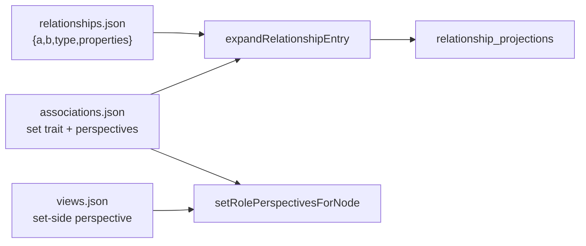

# Sets

## Summary

A **set** is a node that contains other nodes via a relationship type that carries the **`set` trait** in `associations.json`. Set semantics are orthogonal to any particular storage slug: Tome resolves set/member roles from traits and from **caller context** (usually `views.json`), not from a hard-coded membership composite on each type table.

| Concept | Role |
| --- | --- |
| **`set` trait** | Marks an association as set containment (parent = set, child = member) |
| **`ordered` trait** | Optional; sequence key defaults to `order` on the edge |
| **Perspectives** | Exactly two slugs per association; set-side vs member-side from trait indices |
| **Type table** | Set detected via `table-schemas.json` key (and related UI) |
| **Archive hub** | Set detected via `workspace.json` → `archiveNodeId` |

**Example (Marloth project associations — not Tome defaults):**

| Association id | Perspectives | Traits | Typical use |
| --- | --- | --- | --- |
| *(ULID)* | `members` / `member_of` | `set` | Plain type tables, Archive |
| *(ULID)* | `ordered_members` / `ordered_member_of` | `set`, `ordered` | Scenes, Parts, Products (sequence on `order`) |

There is **no `membershipComposite` field** on `table-schemas.json`. Which set association applies for a node comes from **views / caller context** via `setRolePerspectivesForNode` (view set-side perspectives for that node, else a sole set-trait registry fallback).

Peer association (scene↔feature, etc.) remains on separate association ids — see [tome-db.md](./tome-db.md).

## When to read this

Read this doc when your task involves:

- Type-table row membership (members of a type-table set)
- Archive hub membership
- Projection expansion for set-trait edges
- Querying members of a set or sets a node belongs to
- Distinguishing set containment from cross-entity association

For design-domain meaning of types and sets, read [`/workspaces/marloth-story/docs/ontology.md`](../../marloth-story/docs/ontology.md) alongside this doc.

## Requirements

### Set trait and perspectives

Every relationship type in `associations.json` defines a `perspectives` **tuple of exactly two** slugs. Types with `traits` including `set` (or `{ "key": "set", ... }`) are set associations:

- Parent (set) and child (member) indices come from `setRoleIndices` (default parent index 0, child index 1).
- Registry entries carry `traits` as an **array interpreted as a set** — e.g. `["set"]` or `["set", "ordered"]`. Configured traits use `{ "key": "ordered", "property": "rank" }`; when `property` is omitted, `order` is the default sequence key.

**Example content record (Marloth set association with perspectives `members` / `member_of`):**

```json
{
  "a": "<set-id>",
  "b": "<member-id>",
  "type": "<association-ulid>",
  "properties": { "priority": "High" }
}
```

Ordered sets (perspectives `ordered_members` / `ordered_member_of`) use the same parent/child indices with an `order` property when the `ordered` trait applies.

- Endpoints `a` / `b` are an **ordered tuple**: meaning of each index is defined by the type's `perspectives` pair. There is **no lexicographic sorting**.
- **No `directedFrom` field exists** — direction is derived from tuple position + perspectives, not a stored flag.
- Row scalars for type tables live on edge `properties` (keys from `table-schemas.json`). Legacy `row_index` is not written or displayed.

### Perspective resolution (`setRolePerspectivesForNode`)

Primary resolver: `setRolePerspectivesForNode(nodeId, contentDir)` → `[setPerspective, memberPerspective]`.

1. Collect set-side perspectives from `views.json` for that `nodeId`.
2. If any match, resolve the set-trait composite for the first and return its role pair.
3. Else, if the registry has exactly one plain (non-ordered) set-trait composite — or exactly one set-trait composite — use that.
4. Else throw: the project must declare view context or a single set-trait association.

Callers (database views, ordered collections, archive, node create) **must not** invent perspective slugs; they use this helper (or an explicit perspective argument from a view payload).

### Projection expansion

Expansion always emits two projections for registered types:

| Endpoint | Projection |
| --- | --- |
| Index 0 | node at `a` → node at `b` with `perspectives[0]` |
| Index 1 | node at `b` → node at `a` with `perspectives[1]` |

There is **no `bidirectional` field** — the parser rejects any type that does not define exactly two perspectives. (An unregistered storage type falls back to a single defensive projection during sync, but registered types are always a pair.)

For Marloth `member_of` with perspectives `["members", "member_of"]`: `(set)-[:members]->(member)` and `(member)-[:member_of]->(set)` from one content record.

### Set-kind interpretation

Set semantics are **orthogonal** to edge type. A set node carries interpretation via workspace config:

| Set kind | Detection | Member effect |
| --- | --- | --- |
| `type_table` | Node id key in `table-schemas.json` | Members table, Properties panel scalars, type filtering |
| `archive` | `nodeId === workspace.archiveNodeId` | Excluded from search/graph via `nodes.is_archived` |
| Future (tags, scope) | TBD (`sets.json` or node metadata) | Per-set filter rules |

### Query API

Helpers in `packages/tome-db/src/set-membership.ts` (trait-driven; no hard-coded association names):

- `setMemberIds(db, setId)` — members of a set
- `memberSetIds(db, memberId)` — sets a member belongs to
- `setKindForNode(db, nodeId, contentDir)` — `"type_table" | "archive" | null`
- `isSetNode(db, nodeId, contentDir)`
- `findSetEdge(db, memberId, setId)` — edge for a member↔set pair
- `listSetMemberRowConnections(db, setId)` — edges normalized for type-table row building
- `setRolePerspectives(setId, contentDir)` — re-export of `setRolePerspectivesForNode`

**Cardinality** (1:N UI, schema rules) is enforced in UI and `schema.json` — not in storage or projection count. Data layer is M:N.

### Archive hub

Archive membership uses the same set-trait family as type tables (in Marloth: `member_of` edges to the Archive hub). Archiving:

1. Marks incident relationships `archived: true` in content
2. Adds hub set edge (set at parent, member at child; no `archived` on hub edge)
3. Recomputes `nodes.is_archived` on sync

### Link vs create row

Linking or creating a type-table row **must** use the set association resolved for that set (`setRolePerspectivesForNode` / view context). Plain tables get no placement metadata. Ordered tables auto-stamp `order` when missing (`ordered-relationships.ts`).

### Node page sections

| Page kind | Set UI |
| --- | --- |
| **Set / type-table node** | Single members (or ordered-members) table section (`database` or `ordered-collection`) — full columns, tabs, editing via `getDatabaseViewDetail` |
| **Member instance node** | **Properties** panel in metadata (edge scalars) **and** one set-membership relation section below the markdown body |

The auto-generated inverse set-side relation section is **not** emitted on set pages — listing there uses the rich Members table only. The membership section header does **not** link to a single parent set (rows link to each parent).

## Design rationale

**Why dual projections without `directedFrom`?** Set containment is asymmetric in meaning (member belongs to set; set contains members) and that asymmetry is encoded by the **ordered tuple** plus the type's ordered perspectives — not by a stored direction flag.

**Why no `membershipComposite` on table schemas?** Which association a set uses is a **project modeling** choice expressed in `associations.json` and selected by **views / caller context**. Wiring a composite id onto every type table duplicated that choice and hard-coded Marloth slugs into Tome.

**Why unify archive with type tables?** Both are “node belongs to set” with different set-kind behavior. Special-casing archive as peer association duplicated query paths.

## Behavior / pipeline



1. Content write: `ContentStore.upsertRelationship` writes the ordered tuple for the chosen set association (parent at set index, child at member index).
2. Sync: `expandRelationshipEntry` emits two projections from the association's perspectives.
3. Query: type tables and Properties use trait-driven helpers / view perspectives — not a fixed slug.

## Inputs / outputs / artifacts

| Path | Role |
| --- | --- |
| `content/data/relationships.json` | Canonical set edges |
| `content/model/associations.json` | Set-trait associations, perspectives, optional `perspectiveLabels` |
| `content/model/table-schemas.json` | Type-table set detection, column defs (no membership composite field) |
| `content/model/views.json` | Set-side perspective / section config for Members tables |
| `content/model/workspace.json` | `archiveNodeId` for archive set detection |
| `packages/tome-db/src/set-membership.ts` | Set query API |
| `packages/tome-flatfile/src/association-traits.ts` | Set trait helpers (`setRolePerspectivesForNode`, `setRoleIndices`, …) |
| `packages/tome-db/src/content/relationship-sync-expand.ts` | Perspective-based expansion |

## Migration

Historical scripts (marloth-story) and migrations that renamed `is_a` → `member_of`, reordered tuples, and moved archive off peer `includes` are complete for current corpora. New projects register their own set-trait associations; Tome does not require Marloth's `member_of` / `ordered_member_of` names.

**Invariants:**

- Every registered set-trait record → exactly 2 projections
- Archive hub edges use a set-trait association (not peer association)
- Type-table pages show one Members table (not a duplicate auto relation section)

## Non-goals (future)

- **Multi-hop path semantics** — interpreting edge meaning from neighborhood paths (e.g. Types meta-set)
- Requiring a universal storage slug for all set edges across projects
- API-level schema enforcement of allowed edges

## Implementation pointers

| Module | Responsibility |
| --- | --- |
| `set-membership.ts` | `setMemberIds`, `memberSetIds`, `setKindForNode`, edge helpers |
| `association-traits.ts` | `setRolePerspectivesForNode`, trait parsing, ordered property |
| `relationship-sync-expand.ts` | Perspective-count expansion |
| `database-view.ts` | Members table rows via resolved set perspective |
| `node-page-sections.ts` | Members table on set pages; Properties on instances |
| `archive-status.ts` / `node-lifecycle.ts` | Archive via set edge to hub |
| `relationship-link-mutations.ts` | Set edge creation; ordered `order` stamp when applicable |

## See also

- [tome-db.md](./tome-db.md) — property graph storage and sync
- [table-schemas.md](./table-schemas.md) — type-table columns
- [views.md](./views.md) — Members section tabs
- [schema.md](./schema.md) — relationship rules (peer association)
- [ordered-collections.md](./ordered-collections.md) — ordered set views
- [`/workspaces/marloth-story/docs/ontology.md`](../../marloth-story/docs/ontology.md) — design domain model
