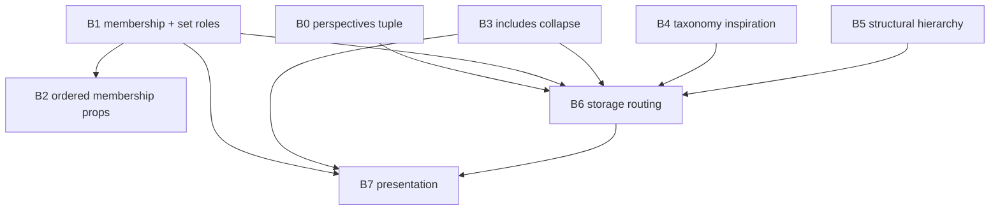

# Relationship type behaviors — inventory overview

> **Superseded inventory.** These docs describe an older includes-collapse / slug-keyed association era.
> For current behavior, use [tome-db.md](../../features/tome-db.md), [sets.md](../../features/sets.md),
> and [relationship-dehardcode-remaining.md](../relationship-dehardcode-remaining.md).
> Association registry keys are now **opaque ULIDs**; perspectives remain snake_case slugs.

## Purpose

This directory inventories **how relationship types behave in Tome today**—what special cases exist, which type names or perspective slugs trigger them, and where the logic lives in `tome-db`.

The docs are **descriptive only**. They record the current lay of the land for future generalization work. They do not propose solutions, config shapes, or refactor sequencing.

Read the overview first, then open only the detail doc for the behavior cluster relevant to your task.

---

## Terminology

| Term | Meaning |
| --- | --- |
| **Storage type** | The `type` field on a relationship record in `content/data/relationships.json` (e.g. `member_of`, `includes`, `scenes_product`). |
| **Perspective** / **local type** | The relationship type as seen from one endpoint—the projection slug used in queries and UI (e.g. `member_of`, `characters`, `parents`). |
| **Composite** | A registered bidirectional storage type in `associations.json` with exactly two perspectives. |
| **Perspective slug** | A local type string that may or may not be a registered composite key—many slugs in `includes-relationship.ts` are **not** separate registry entries. |
| **Behavior** / **trait** | Informal label for a cross-cutting capability (membership, includes collapse, row ordering, etc.). Used in these docs only—not a code type. |

One storage type or perspective can participate in **multiple behaviors** implemented in different subsystems. Behaviors are not orthogonal or uniform.

---

## Baseline: what is already generalized (B0)

**Direction and per-position roles** are config-driven:

- Every relationship is an ordered tuple `{ a, b, type }`.
- Each registered type in `content/model/associations.json` defines `perspectives: [p0, p1]`—one slug projected from each endpoint.
- Symmetric types repeat the same slug in both positions (e.g. `includes`).
- Asymmetric types use distinct slugs (e.g. `member_of` / `members`).
- Parser and helpers: [`packages/tome-db/src/content/associations-file.ts`](../../../packages/tome-db/src/content/associations-file.ts).

No `directedFrom` field exists; tuple position + perspectives define direction.

---

## Behavior index

| ID | Doc | One-line description |
| --- | --- | --- |
| **B1** | [01-membership-and-set-roles.md](./01-membership-and-set-roles.md) | Set membership edge (`member_of`/`members`) and which nodes count as sets (type tables, archive hub). |
| **B2** | [02-ordered-membership-props.md](./02-ordered-membership-props.md) | Ordered membership (`order` on `ordered_member_of`); plain membership holds table-schema scalars only. |
| **B3** | [03-associative-includes-collapse.md](./03-associative-includes-collapse.md) | Many perspective slugs stored under the single `includes` bucket. |
| **B4** | [04-taxonomy-inspiration.md](./04-taxonomy-inspiration.md) | Taxonomy↔inspiration links stored as `{perspective}_inspirations` composites. |
| **B5** | [05-structural-hierarchy.md](./05-structural-hierarchy.md) | Parent/child perspectives routed to `parents_children`; inverse type inference. |
| **B6** | [06-storage-routing.md](./06-storage-routing.md) | Write path: which storage type a new link becomes, and tuple order. |
| **B7** | [07-relation-presentation.md](./07-relation-presentation.md) | Node-page relation sections: sort, grouping, add-mode, labels. |
| **C** | [08-migration-residue.md](./08-migration-residue.md) | Legacy composite names and migration-era lookup shortcuts. |

---

## Subsystem touch map

Which `tome-db` modules participate in which behaviors (factual; modules may touch multiple behaviors).

| Module | Behaviors |
| --- | --- |
| [`includes-relationship.ts`](../../../packages/tome-db/src/includes-relationship.ts) | B3, B4, B5, B7, C |
| [`resolve-composite-for-link.ts`](../../../packages/tome-db/src/content/resolve-composite-for-link.ts) | B1, B3, B4, B5, B6 |
| [`content/store.ts`](../../../packages/tome-db/src/content/store.ts) | B3, B6 |
| [`set-membership.ts`](../../../packages/tome-db/src/set-membership.ts) | B1, B2 |
| [`labels.ts`](../../../packages/tome-db/src/labels.ts) | B1 |
| [`node-capabilities.ts`](../../../packages/tome-db/src/node-capabilities.ts) | B1 |
| [`graph.ts`](../../../packages/tome-db/src/graph.ts) | B1 |
| [`relationship-link-mutations.ts`](../../../packages/tome-db/src/relationship-link-mutations.ts) | B1, B2 |
| [`node-create.ts`](../../../packages/tome-db/src/node-create.ts) | B1, B2, B3 |
| [`archive-status.ts`](../../../packages/tome-db/src/archive-status.ts) | B1 |
| [`relationship-archive.ts`](../../../packages/tome-db/src/relationship-archive.ts) | B1 |
| [`type-membership-audit.ts`](../../../../marloth-story/scripts/lib/type-membership-audit.ts) | B1, B2 (moved to marloth-story; legacy export hygiene) |
| [`database-view-relations.ts`](../../../packages/tome-db/src/database-view-relations.ts) | B3, B4, B5, C |
| [`schema-rules/resolve.ts`](../../../packages/tome-db/src/schema-rules/resolve.ts) | B3 |
| [`node-page-sections.ts`](../../../packages/tome-db/src/node-page-sections.ts) | B2, B3, B7 |
| [`association-label.ts`](../../../packages/tome-db/src/association-label.ts) | B7 |
| [`ordered-collections-config/ordered-collections-file.ts`](../../../packages/tome-db/src/ordered-collections-config/ordered-collections-file.ts) | B1, B2 |

---

## Central hardcode files

These files concentrate type-name special casing:

| File | Role |
| --- | --- |
| [`includes-relationship.ts`](../../../packages/tome-db/src/includes-relationship.ts) | Hardcoded `ReadonlySet`s of perspective slugs; includes/taxonomy/hierarchy classification helpers. |
| [`resolve-composite-for-link.ts`](../../../packages/tome-db/src/content/resolve-composite-for-link.ts) | Priority ladder for write-path storage type resolution. |
| [`set-membership.ts`](../../../packages/tome-db/src/set-membership.ts) | Literal `member_of` storage type; set node ID collection. |
| [`node-page-sections.ts`](../../../packages/tome-db/src/node-page-sections.ts) | Relation section grouping, sort keys, add-mode selection. |
| [`database-view-relations.ts`](../../../packages/tome-db/src/database-view-relations.ts) | Read-path relation lookup; `inferInverseRelationType` switch. |

---

## Existing model files (as used today)

| File | Relationship-related role |
| --- | --- |
| [`content/model/associations.json`](../../../../marloth-story/content/model/associations.json) | Registered composites, perspectives, optional `perspectiveLabels`. |
| [`content/model/relationships.json`](../../../../marloth-story/content/model/relationships.json) | Stored edges: `{ a, b, type, properties? }`. |
| [`content/model/table-schemas.json`](../../../../marloth-story/content/model/table-schemas.json) | Type-table column defs; relation columns carry `perspective` and `targetTypeId`. Keys are set node IDs. |
| [`content/model/workspace.json`](../../../../marloth-story/content/model/workspace.json) | `archiveNodeId` (archive hub set node). |
| [`content/model/schema.json`](../../../../marloth-story/content/model/schema.json) | `relationshipRules` — allowed target types per source type + perspective. |
| [`content/model/table-presentation.json`](../../../../marloth-story/content/model/table-presentation.json) | Composed table presentation (scope tabs, groups, reorder). |

Domain values above are from the Marloth corpus; `silentorb-web` has an empty `associations.json` registry.

---

## Related feature docs

- [Set membership](../../features/sets.md)
- [Table presentation](../../features/table-presentation.md)
- [tome-db](../../features/tome-db.md)
- [Table schemas](../../features/table-schemas.md)

---

## How behaviors interact

`member_of` is the clearest example of **multiple behaviors on one edge type**: B1 (membership semantics), B2 (row props), B6 (routing step 0), and B7 (presentation sort/hide).
