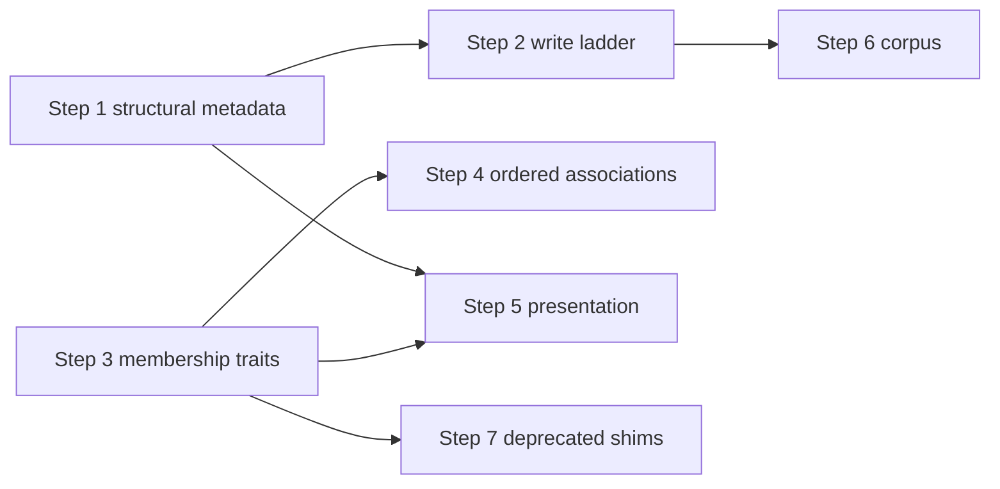

# Relationship type dehardcoding — what's left

## Purpose

This doc lists **remaining work** to remove relationship-type hardcoding from `tome-db` and the Marloth corpus. It is forward-looking and action-oriented—not a behavior inventory.

For how relationships work today, see [tome-db feature doc](../features/tome-db.md), [set membership](../features/set-membership.md), and [ordered associations](../features/ordered-associations.md). The descriptive inventory in [`relationship-behaviors/`](relationship-behaviors/) restates much of what is already implemented; use it only if you need module-level detail on current behavior.

---

## Already done

Major hardcoding removed in commits `7466952`–`1f9beb3`:

| Done | Artifact |
| --- | --- |
| Perspectives tuple + tuple-order semantics | Registry `perspectives`; `orderedEndpointsForLocalType` in [`store.ts`](../../packages/tome-db/src/content/store.ts) |
| `set` / `ordered` traits | [`relationship-type-traits.ts`](../../packages/tome-db/src/relationship-type-traits.ts), registry `traits` array |
| Per-flavor composites + `endpoints` | Includes collapse deleted; [`relationship-types.json`](../../../marloth-story/content/model/relationship-types.json) |
| Table-schema `relationshipType` on relation columns | [`table-relation-column.ts`](../../packages/tome-db/src/table-relation-column.ts) |
| Write-path: table-schema + registry scan (no includes fallback) | [`resolve-composite-for-link.ts`](../../packages/tome-db/src/content/resolve-composite-for-link.ts) steps 0, 3, 4 |
| Read-path: column-driven hydration | [`database-view-relations.ts`](../../packages/tome-db/src/database-view-relations.ts) |
| Allowed targets from registry endpoints | [`relationship-type-endpoints.ts`](../../packages/tome-db/src/relationship-type-endpoints.ts); `schema-rules/resolve.ts` shim |
| Write-path: flattened ladder (set-trait → table-schema → registry scan → error) | [`resolve-composite-for-link.ts`](../../packages/tome-db/src/content/resolve-composite-for-link.ts); no production auto-registration in [`store.ts`](../../packages/tome-db/src/content/store.ts) |

---

## Work order

Do these in sequence. Steps **1–3** are the critical path; step **5** waits on **1** and **3**; step **6** can start once **2** is stable.

| Step | Topic | Depends on |
| --- | --- | --- |
| **1** | [Structural registry metadata](#step-1-structural-registry-metadata) | — |
| **2** | [Flatten write-path ladder + auto-registration](#step-2-flatten-write-path-ladder--auto-registration) | 1 (structural trait replaces slug sets used in step 2 cleanup) |
| **3** | [Trait-derive membership](#step-3-trait-derive-membership) | — (parallel with 1–2, but must finish before step 5) |
| **4** | [Ordered-associations decouple](#step-4-ordered-associations-decouple) | 3 |
| **5** | [Presentation pass](#step-5-presentation-pass) | 1, 3 |
| **6** | [Corpus cleanup](#step-6-corpus-cleanup) | 2 (stable write path) |
| **7** | [Deprecated API cleanup](#step-7-deprecated-api-cleanup) | 3 |

---

## Step details

### Step 1 — Structural registry metadata

**Removes:** hardcoded `STRUCTURAL_LINK_PERSPECTIVES`, `PARENTS_CHILDREN_COMPOSITE` check, redundant taxonomy branch in link-existing policy.

[`relationship-type-endpoints.ts`](../../packages/tome-db/src/relationship-type-endpoints.ts) today:

- `STRUCTURAL_LINK_PERSPECTIVES` = `{ parents, children, part }` → `addMode: "none"`
- Explicit `parents_children` composite check in `relationSectionSupportsLinkExisting`
- Redundant `TAXONOMY_INSPIRATION_PERSPECTIVES` branch (always returns true)

**Work:** Add registry metadata—e.g. trait `structural`, or `perspectiveLabels[p].linkExisting: false`—and read it in presentation and link policy. `part` is already a normal composite (`scenes_part`); it should not require a global slug set.

**Unblocks:** step 2 (delete slug-based structural checks), step 5 (config-driven addMode).

---

### Step 2 — Flatten write-path ladder + auto-registration (done)

**Removed:** write-path ladder steps 1–2; family-specific auto-registration templates in `store.ts`.

---

### Step 3 — Trait-derive membership

**Removes:** literal `member_of` / `ordered_member_of` / `TYPE_MEMBERSHIP_TYPES` checks across ~15 modules.

[`labels.ts`](../../packages/tome-db/src/labels.ts) exports `MEMBER_OF_TYPE`, `ORDERED_MEMBER_OF_TYPE`, `TYPE_MEMBERSHIP_TYPES`, `isTypeMembershipType`, etc. Still referenced in:

| Module | Hardcoding |
| --- | --- |
| [`node-capabilities.ts`](../../packages/tome-db/src/node-capabilities.ts) | `hasIncomingIsA` — four literal perspective queries |
| [`graph.ts`](../../packages/tome-db/src/graph.ts) | SQL `type IN ('members', 'member_of')`; archive recompute loops only `member_of` |
| [`node-page-sections.ts`](../../packages/tome-db/src/node-page-sections.ts) | Hide `members` / `ordered_members`; membership sort key |
| [`node-lifecycle.ts`](../../packages/tome-db/src/node-lifecycle.ts) | Archive hub always uses `MEMBER_OF_TYPE` |
| [`ordered-associations.ts`](../../packages/tome-db/src/ordered-associations.ts) | `ORDERED_MEMBER_OF_TYPE` in scope queries |
| [`ordered-relationships.ts`](../../packages/tome-db/src/ordered-relationships.ts) | `orderedMembershipCompositeType()` returns literal |
| [`database-column-data.ts`](../../packages/tome-db/src/database-column-data.ts), [`dynamic-fields/resolvers/index.ts`](../../packages/tome-db/src/dynamic-fields/resolvers/index.ts), [`type-membership-audit.ts`](../../packages/tome-db/src/type-membership-audit.ts) | Iterate `TYPE_MEMBERSHIP_TYPES` |

**Work:** Derive membership perspectives from `typesWithTrait(registry, "set")` and `membershipCompositeForSet`. Archive hub should call `membershipCompositeForSet(archiveNodeId)`, not literal `member_of`. Archive SQL should filter by set-trait storage types dynamically, not `IN ('members', 'member_of')`.

Residual: [`membershipCompositeForSet`](../../packages/tome-db/src/relationship-type-traits.ts) defaults to literal `member_of` when a table has no `membershipComposite`—default from registry instead.

**Unblocks:** steps 4, 5, 7.

---

### Step 4 — Ordered-associations decouple

**Removes:** literal `ordered_member_of` validation and hardcoded `"part"` perspective on moves.

| Location | Hardcoding |
| --- | --- |
| [`ordered-associations-config/ordered-associations-file.ts`](../../packages/tome-db/src/ordered-associations-config/ordered-associations-file.ts) | Validates `membershipComposite === "ordered_member_of"` literally |
| [`ordered-relationships.ts`](../../packages/tome-db/src/ordered-relationships.ts) | `orderedMembershipCompositeType()` returns literal |
| [`ordered-associations.ts`](../../packages/tome-db/src/ordered-associations.ts) | Move path calls `upsertRelationship(..., "part", ...)` |

**Work:** Validate that `membershipComposite` has the `ordered` trait (from step 3 helpers). Resolve group-link perspective from `groupCompositeType` in [`ordered-associations.json`](../../../marloth-story/content/model/ordered-associations.json) via [`perspectiveForRelationColumn`](../../packages/tome-db/src/table-relation-column.ts).

**Depends on:** step 3.

---

### Step 5 — Presentation pass

**Removes:** remaining presentation hardcoding in [`node-page-sections.ts`](../../packages/tome-db/src/node-page-sections.ts) not covered by steps 1 and 3.

**Work:**

- **addMode** — read step 1 structural metadata (replaces `STRUCTURAL_LINK_PERSPECTIVES` slug set)
- **Hide inverse set perspectives** — derive set-side perspectives from `set` trait registry entries (replaces literal `members` / `ordered_members` checks from step 3)
- **Sort membership last** — trait-based instead of `isTypeMembershipType`

**Depends on:** steps 1 and 3. Do not start until both land.

---

### Step 6 — Corpus cleanup

**Removes:** import-era data shapes; not `tome-db` source but required for a clean audit.

- ~13 ULID-suffixed registry keys (e.g. `XY3V_inspirations_XXW0`) — consolidate to semantic names where `endpoints` allow
- Residual `type: "includes"` rows in [`relationships.json`](../../../marloth-story/content/data/relationships.json) — run [`audit-relationship-resolution.ts`](../../packages/tome-db/scripts/audit-relationship-resolution.ts); migrate to per-flavor types
- Optional: delete [`relationship-behaviors/`](relationship-behaviors/) descriptive docs

**Depends on:** step 2 (migrations assume flattened write path).

Can run in parallel with steps 4–5 once step 2 is stable.

---

### Step 7 — Deprecated API cleanup

**Removes:** shim layer after callers migrate.

[`schema-rules/resolve.ts`](../../packages/tome-db/src/schema-rules/resolve.ts) — deprecated wrappers that void `schema` and delegate to `relationshipTypeRuleContext`.

**Work:** Migrate remaining callers to `relationshipTypeRuleContext` directly; delete shims and unused `labels.ts` exports.

**Depends on:** step 3 (callers should use trait-based helpers first).

---

## Definition of done

Relationship type hardcoding is removed when:

- No `ReadonlySet` of perspective slugs in production source (tests/fixtures excepted)
- No literal checks for `member_of`, `parents_children`, or taxonomy slug sets outside empty-workspace registry seed helpers
- Write path is only: **set-trait → table-schema column → registry scan → error**
- Presentation and link-existing policy read registry traits / perspective labels only
- Archive, ordered-associations, and SQL cache queries derive membership from `set` trait, not fixed type name lists
- Marloth content passes [`audit-relationship-resolution.ts`](../../packages/tome-db/scripts/audit-relationship-resolution.ts) with zero blockers
- [`docs/features/tome-db.md`](../features/tome-db.md) updated to describe per-flavor composites (still mentions includes collapse today—separate doc fix)

---

## Related docs

| Doc | Role |
| --- | --- |
| [tome-db](../features/tome-db.md) | Feature spec (needs includes-collapse wording update) |
| [set-membership](../features/set-membership.md) | Set trait semantics |
| [ordered-associations](../features/ordered-associations.md) | Grouped ordered views |
| [relationship-behaviors/](relationship-behaviors/) | Descriptive inventory (optional reference; not this roadmap) |
| [relationship-types/](relationship-types/) | Superseded includes-collapse-era inventory |
