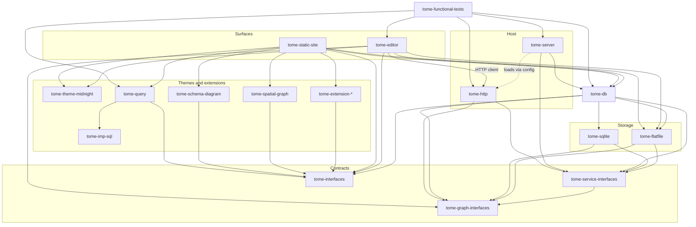

# Tome packages

Each subdirectory is a **workspace package** in the Tome monorepo. Packages are domain-agnostic unless their name indicates otherwise (e.g. `tome-extension-*`).

| Package | Role |
| --- | --- |
| [`tome-flatfile`](./tome-flatfile/) | Flatfile content store + change watching |
| [`tome-sqlite`](./tome-sqlite/) | SQLite graph database (query cache today) |
| [`tome-db`](./tome-db/) | Domain queries/mutations + content↔cache sync |
| [`tome-graph-interfaces`](./tome-graph-interfaces/) | Domain DTOs and `TomeGraphServices` contract |
| [`tome-service-interfaces`](./tome-service-interfaces/) | Store/cache/service module contracts |
| [`tome-http`](./tome-http/) | HTTP service module + typed HTTP client |
| [`tome-server`](./tome-server/) | Config-driven host (store, cache, service modules) |
| [`tome-editor`](./tome-editor/) | Browser editor (client UI only) |
| [`tome-static-site`](./tome-static-site/) | Static HTML export |
| [`tome-theme-midnight`](./tome-theme-midnight/) | Midnight theme tokens and shared cross-surface CSS |
| [`tome-interfaces`](./tome-interfaces/) | Extension / page-block integration contracts |
| [`tome-extension-fixture`](./tome-extension-fixture/) | Reference/test extension (not production) |
| [`tome-spatial-graph`](./tome-spatial-graph/) | Compound spatial graph page block (cytoscape SVG) |
| [`tome-imp-sql`](./tome-imp-sql/) | Imp → Tome SQL schema/registry binder (above tome-db) |
| [`tome-query`](./tome-query/) | Imp-backed custom table page block (React Flow → SQL) |
| [`tome-sequencing-interfaces`](./tome-sequencing-interfaces/) | Shared sequencing domain types |
| [`tome-sequencing-resolution`](./tome-sequencing-resolution/) | Relative chronology constraint resolution |
| [`tome-sequencing`](./tome-sequencing/) | Timeline page block (Imp query + visx) |
| [`tome-functional-tests`](./tome-functional-tests/) | Cross-package functional tests (dev-only; not a runtime library) |

## Package documentation

Every package includes:

- **`README.md`** — brief context: what the package is and why it exists (no runbooks).
- **`AGENTS.md`** — how to work in the package (commands, layout, conventions).

When adding a new package, add both files before landing substantial code.
