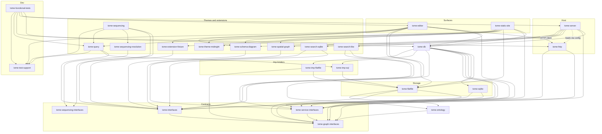

# Tome packages

Each subdirectory is a **workspace package** in the Tome monorepo. Packages are domain-agnostic unless their name indicates otherwise (e.g. `tome-extension-*`).

This file is the **sole package inventory**: the table and diagram below must list every `packages/*` workspace package.

| Package | Role |
| --- | --- |
| [`tome-flatfile`](./tome-flatfile/) | Flatfile content store + change watching |
| [`tome-sqlite`](./tome-sqlite/) | SQLite graph database (query cache today) |
| [`tome-db`](./tome-db/) | Domain queries/mutations + content↔cache sync |
| [`tome-graph-interfaces`](./tome-graph-interfaces/) | Domain DTOs and `TomeGraphServices` contract |
| [`tome-ontology`](./tome-ontology/) | Store-independent ontology runtime (predicates + patterns) |
| [`tome-service-interfaces`](./tome-service-interfaces/) | Store/cache/service module contracts |
| [`tome-http`](./tome-http/) | HTTP service module + typed HTTP client |
| [`tome-server`](./tome-server/) | Config-driven host (store, cache, service modules) |
| [`tome-editor`](./tome-editor/) | Browser editor (client UI only) |
| [`tome-static-site`](./tome-static-site/) | Static HTML export |
| [`tome-theme-midnight`](./tome-theme-midnight/) | Midnight theme tokens and shared cross-surface CSS |
| [`tome-interfaces`](./tome-interfaces/) | Extension / page-block integration contracts |
| [`tome-search-like`](./tome-search-like/) | SQL LIKE searcher extension (`kind: searcher`) |
| [`tome-search-sqlite`](./tome-search-sqlite/) | FTS5 searcher + Imp sync sink (`dataStores` + `kind: searcher`) |
| [`tome-extension-fixture`](./tome-extension-fixture/) | Reference/test extension (not production) |
| [`tome-spatial-graph`](./tome-spatial-graph/) | Compound spatial graph page block (cytoscape SVG) |
| [`tome-schema-diagram`](./tome-schema-diagram/) | Schema diagram page block (ELK → SVG) |
| [`tome-imp-sql`](./tome-imp-sql/) | Imp → Tome SQL schema/registry binder (above tome-db) |
| [`tome-imp-flatfile`](./tome-imp-flatfile/) | Imp flatfile execution host over git-tracked content (used by tome-db) |
| [`tome-query`](./tome-query/) | Imp-backed custom table page block (React Flow → SQL) |
| [`tome-sequencing-interfaces`](./tome-sequencing-interfaces/) | Shared sequencing domain types |
| [`tome-sequencing-resolution`](./tome-sequencing-resolution/) | Relative chronology constraint resolution |
| [`tome-sequencing`](./tome-sequencing/) | Timeline page block (Imp query + visx) |
| [`tome-functional-tests`](./tome-functional-tests/) | Cross-package functional tests (dev-only; not a runtime library) |
| [`tome-test-support`](./tome-test-support/) | Essential/nonessential tier helpers + weighted gate math (dev-only) |

```mermaid
flowchart TB
  subgraph contracts [Contracts]
    GI[tome-graph-interfaces]
    SI[tome-service-interfaces]
    EI[tome-interfaces]
    SEQI[tome-sequencing-interfaces]
    SI --> GI
    EI --> GI
  end

  ON[tome-ontology]
  ON --> GI

  subgraph storage [Storage]
    SF[tome-flatfile]
    CS[tome-sqlite]
  end

  SF --> SI
  SF --> GI
  SF --> ON
  CS --> SI
  CS --> GI

  subgraph impBinders [Imp binders]
    IMPSQL[tome-imp-sql]
    IMPFF[tome-imp-flatfile]
  end

  IMPSQL --> SF
  IMPFF --> SF
  IMPFF --> GI

  DB[tome-db]
  DB --> SF
  DB --> CS
  DB --> GI
  DB --> SI
  DB --> EI
  DB --> ON
  DB --> IMPSQL
  DB --> IMPFF

  subgraph host [Host]
    SRV[tome-server]
    HTTP[tome-http]
  end

  SRV --> DB
  SRV --> SI
  SRV -.->|loads via config| HTTP
  HTTP --> SI
  HTTP --> GI

  subgraph surfaces [Surfaces]
    ED[tome-editor]
    SS[tome-static-site]
  end

  ED -->|HTTP client| HTTP
  ED --> DB
  ED --> GI
  ED --> EI
  ED --> SF
  SS --> DB
  SS --> EI
  SS --> SF

  subgraph plugins [Themes and extensions]
    TH[tome-theme-midnight]
    EXT[tome-extension-fixture]
    SP[tome-spatial-graph]
    SD[tome-schema-diagram]
    SL[tome-search-like]
    SSQ[tome-search-sqlite]
    Q[tome-query]
    SEQ[tome-sequencing]
    SEQR[tome-sequencing-resolution]
  end

  EXT --> EI
  SP --> EI
  SD --> EI
  SL --> EI
  SL --> SI
  SSQ --> EI
  SSQ --> SI
  Q --> EI
  Q --> IMPSQL
  SEQR --> SEQI
  SEQ --> EI
  SEQ --> SEQI
  SEQ --> SEQR
  SEQ --> Q
  SRV --> SL
  SRV --> SSQ
  SRV --> SP
  SRV --> SD
  ED --> TH
  ED --> EXT
  ED --> SD
  SS --> TH
  SS --> EXT
  SS --> SP
  SS --> SD
  SS --> Q

  subgraph dev [Dev]
    FT[tome-functional-tests]
    TS[tome-test-support]
  end

  FT --> DB
  FT --> ED
  FT --> SRV
  FT --> HTTP
  FT --> Q
  FT --> TS
  ED --> TS
  Q --> TS
  SEQ --> TS
```

## Package documentation

Every package includes:

- **`README.md`** — brief context: what the package is and why it exists (no runbooks).
- **`AGENTS.md`** — how to work in the package (commands, layout, conventions).

When adding, removing, or renaming a `packages/*` workspace package, in the same change:

1. Create, delete, or rename the package directory (and its `package.json`).
2. Add, remove, or update that package’s `README.md` and `AGENTS.md`.
3. Add, remove, or rewrite the matching row in the **table** above.
4. Add, remove, or rewrite the matching **mermaid** node and edges above.

Do not maintain a second package table or diagram in the root README — that file only links here.
